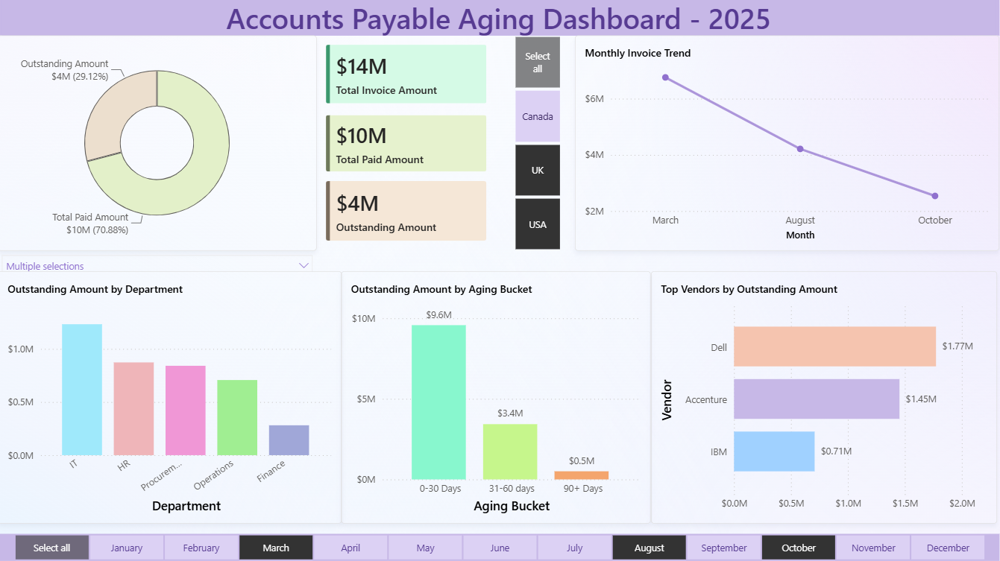

# 📊 Accounts Payable Aging Dashboard

## Overview

This project is an interactive Power BI dashboard built to analyze Accounts Payable (AP) performance using a sample dataset of 1,000 invoices.

## Dashboard Preview

> Replace the line below with your screenshot after uploading it.

## Features

- KPI Cards
  - Total Invoice Amount
  - Total Paid Amount
  - Outstanding Amount
  - Total Invoices
- Monthly Invoice Trend
- Invoice Aging Analysis
- Top Vendors by Outstanding Amount
- Outstanding Amount by Department
- Country, Vendor and Month slicers

## Tools Used

- Power BI Desktop
- DAX
- Power Query
- Excel

## Skills Demonstrated

- Data Modeling
- DAX Measures
- Interactive Dashboard Design
- Business KPI Reporting
- Data Visualization
